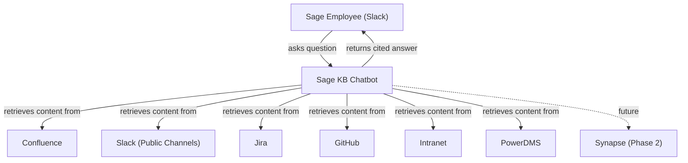
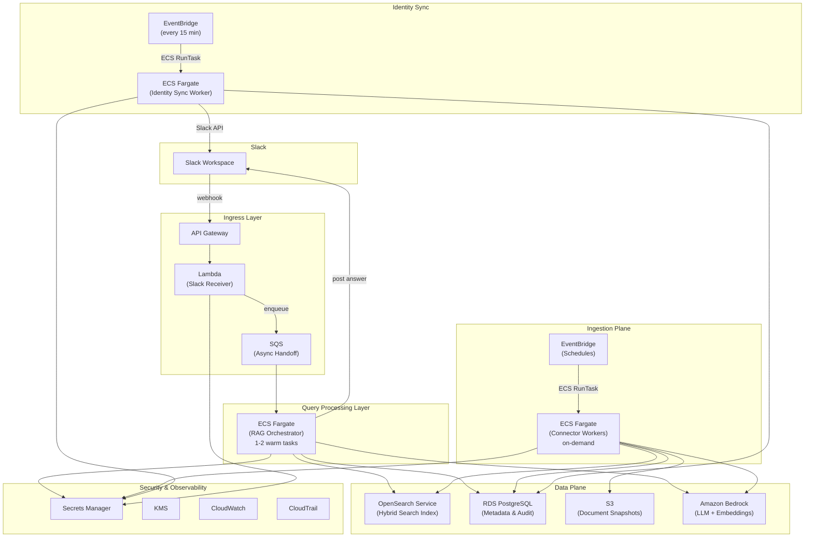
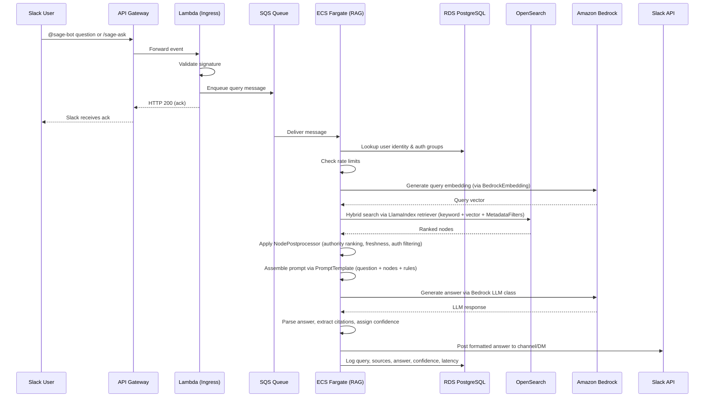
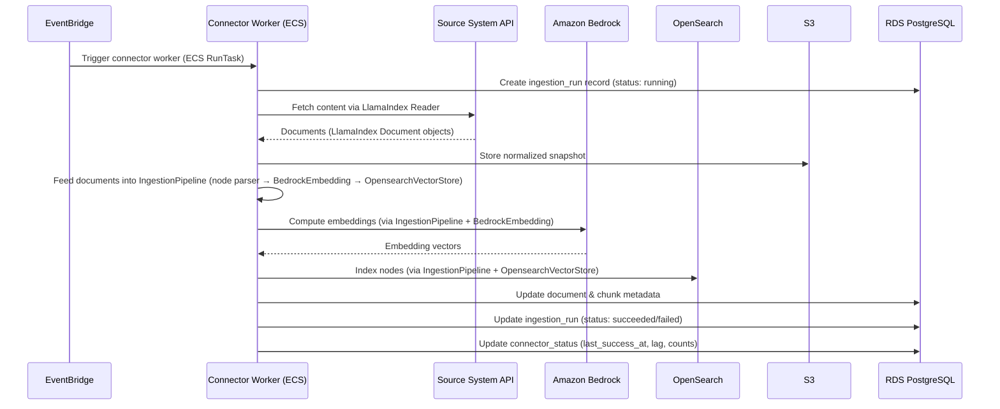
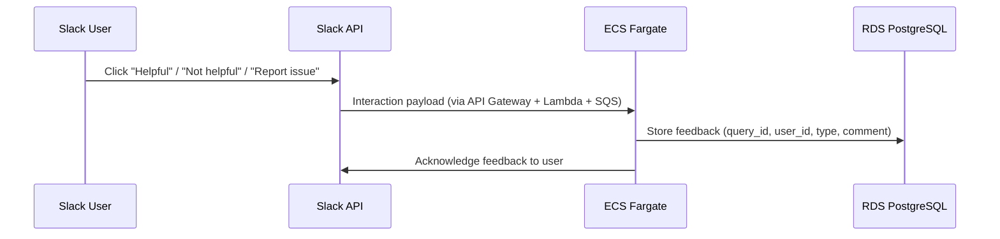
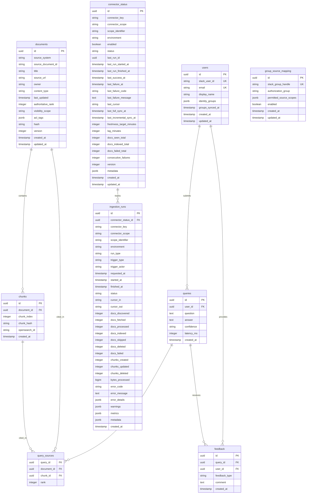

# Design Document: Sage Internal Knowledge Slack Chatbot

## Overview

The Sage Internal Knowledge Slack Chatbot is an internal assistant that answers employee questions using a Retrieval-Augmented Generation (RAG) architecture. It ingests content from multiple internal knowledge sources — Confluence, Slack (public channels), Jira, GitHub, the intranet, and PowerDMS for MVP — indexes that content into a hybrid search engine, and generates grounded, cited answers delivered through Slack.

The system is built entirely on AWS managed services, with **LlamaIndex** as the RAG framework for ingestion, retrieval, and query orchestration. A thin Lambda function handles Slack event ingress and immediate acknowledgment, then hands off to an always-on ECS Fargate service for the heavy RAG orchestration work. Ingestion is driven by EventBridge schedules that directly trigger connector-specific ECS Fargate workers using LlamaIndex Readers (from LlamaHub where available) and `IngestionPipeline`. All interactions are auditable, permission-aware, and designed for phased source onboarding.

The design prioritizes retrieval quality over generative creativity: every answer must be grounded in retrieved content, cite its sources, and clearly communicate confidence. When evidence is insufficient, the bot refuses to answer rather than hallucinate.

## Architecture

### System Context

### High-Level Architecture

## Components and Interfaces

### Component 1: Slack Ingress (Lambda)

**Purpose**: Receives Slack events (app mentions, DMs, slash commands), validates request signatures, acknowledges immediately (within 3 seconds), and enqueues the request for async processing.

**Responsibilities**:
- Validate Slack request signatures using the signing secret
- Parse event type (app_mention, message, slash command `/sage-ask`)
- Extract user ID, channel ID, question text, and thread timestamp
- Enqueue a structured message to SQS
- Return HTTP 200 acknowledgment to Slack immediately
- Reject malformed or unsigned requests

**Interactions**:
- Receives from: API Gateway
- Sends to: SQS (async handoff queue)
- Reads from: Secrets Manager (Slack signing secret)

---

### Component 2: Async Handoff Queue (SQS)

**Purpose**: Decouples the fast Slack acknowledgment from the slower RAG processing, providing backpressure and retry semantics.

**Responsibilities**:
- Buffer query messages between Lambda and ECS Fargate
- Enforce message visibility timeout aligned with RAG processing SLA
- Route failed messages to a dead-letter queue (DLQ) after max retries
- Support rate limiting by controlling consumer concurrency

**Interactions**:
- Receives from: Lambda (Slack Ingress)
- Consumed by: ECS Fargate (RAG Orchestrator)
- DLQ alerts: CloudWatch

---

### Component 3: RAG Orchestrator (ECS Fargate)

**Purpose**: The core chatbot backend. Consumes query messages, performs identity mapping, authorization, retrieval, prompt assembly, LLM invocation, and delivers the answer back to Slack. Uses LlamaIndex for retrieval, prompt assembly, and generation.

**Responsibilities**:
- Poll SQS for incoming query messages
- Map Slack user ID to internal identity and authorization groups (read from `users.identity_groups`, populated by the Slack User Groups sync job)
- Enforce per-user and per-channel rate limits
- Use LlamaIndex's retriever (backed by `OpensearchVectorStore`) to generate query embeddings and execute hybrid search with `MetadataFilters` for authorization
- Apply custom `NodePostprocessor` for source authority ranking and freshness boost
- Apply custom `NodePostprocessor` for authorization filtering
- Assemble the LLM prompt using LlamaIndex's `PromptTemplate` with grounding rules, citation instructions, and answering rules
- Invoke Amazon Bedrock for answer generation via LlamaIndex's `Bedrock` LLM class
- Parse LLM response, extract citations, assign confidence level
- Post formatted answer to Slack (answer, confidence, sources, notes)
- Log query, retrieved sources, answer, confidence, and latency to PostgreSQL (custom code)
- Handle feedback interactions (helpful/not helpful/report issue)

**Scaling**:
- Minimum 1–2 warm tasks in production
- Auto-scale based on SQS queue depth
- Maximum 25 concurrent RAG jobs (global limit)

**Interactions**:
- Consumes from: SQS
- Reads/writes: RDS PostgreSQL, OpenSearch
- Invokes: Amazon Bedrock (embeddings + generation)
- Posts to: Slack API
- Reads from: Secrets Manager

---

### Component 4: Ingestion Pipeline

**Purpose**: Periodically fetches content from each source system, normalizes it, chunks it, computes embeddings, and indexes it into OpenSearch with metadata stored in PostgreSQL.

**Sub-components**:

#### 4a. Scheduler (EventBridge)

Triggers ingestion runs on source-specific schedules:
- Confluence: every 6 hours
- Slack (public channels): every 1 hour
- Jira (all projects): every 1 hour
- GitHub: every 1 hour
- Intranet: every 12 hours
- PowerDMS: every 12 hours

#### 4b. Connector Workers (ECS Fargate, on-demand)

Each source has an isolated connector worker that uses a LlamaIndex Reader (from LlamaHub where available) and the shared `IngestionPipeline`:
- Fetches content using a LlamaIndex Reader (`ConfluenceReader`, `SlackReader`, `JiraReader`, `GithubRepositoryReader`, `BeautifulSoupWebReader`) or a custom `BaseReader` (PowerDMS)
- Reader returns normalized `Document` objects with text and metadata
- Feeds documents into LlamaIndex's `IngestionPipeline` configured with:
  - Node parser for chunking (semantic/structure-first strategy)
  - `BedrockEmbedding` for embedding generation
  - `OpensearchVectorStore` for indexing
  - Content-hash deduplication to skip unchanged documents
- Stores normalized snapshots in S3 (custom step, outside LlamaIndex pipeline)
- Updates document and chunk metadata in PostgreSQL (custom step)

Each connector worker is responsible for managing its own `ingestion_runs` and `connector_status` records:
- Creates `ingestion_runs` record (status: running) at start
- Updates `ingestion_runs` status (succeeded/failed) on completion
- Updates `connector_status` (last_success_at, lag, counts) on completion
- Handles its own error tracking (increment `consecutive_failures` on failure)

**Interactions**:
- Triggered by: EventBridge (direct ECS RunTask)
- Reads from: Source system APIs, Secrets Manager
- Writes to: OpenSearch (via `OpensearchVectorStore`), RDS PostgreSQL, S3
- Invokes: Amazon Bedrock (via `BedrockEmbedding`)

---

### Component 4e: Identity Sync Worker (ECS Fargate, on-demand)

**Purpose**: Synchronizes Slack User Group membership to the `users.identity_groups` field in PostgreSQL, providing the authorization context used at query time.

**Schedule**: EventBridge triggers an ECS Fargate task every 15 minutes.

**Responsibilities**:
- Call Slack `usergroups.list` to enumerate configured Slack User Groups
- Call `usergroups.users.list` for each group to resolve current members
- For each user, compute the set of authorization groups from group membership
- Upsert `users` records in PostgreSQL: update `identity_groups` (JSONB) and `groups_synced_at`
- Auto-create user records for new Slack users discovered during sync (populate email, display_name from Slack profile)
- Respect Slack API rate limits (Tier 2: ~20 req/min) with exponential backoff
- Log sync results: users updated, groups changed, errors encountered

**Configuration**:
- The mapping from Slack User Groups to chatbot authorization groups is defined in a version-controlled YAML file (`config/group_source_mapping.yaml`) and synced to the `group_source_mapping` PostgreSQL table during deployment via a CDK custom resource Lambda (see Component 6)
- The YAML file is the single source of truth — rows not present in the file are disabled on deploy
- Changes go through the normal PR review process for governance visibility
- Admins manage user-level access by adding/removing users from Slack User Groups in Slack — no separate admin UI required for MVP

**Interactions**:
- Triggered by: EventBridge (every 15 minutes, ECS RunTask)
- Reads from: Slack API (`usergroups.list`, `usergroups.users.list`), Secrets Manager (Slack bot token)
- Writes to: RDS PostgreSQL (`users` table)
- Reads from: RDS PostgreSQL (`group_source_mapping` config)

---

### Component 5: OpenSearch Service (Hybrid Search Index)

**Purpose**: Stores document chunks with both text content and vector embeddings, supporting hybrid keyword + semantic search with metadata filtering. Managed via LlamaIndex's `OpensearchVectorStore` abstraction.

**Responsibilities**:
- Store indexed chunks with all required fields (document_id, chunk_id, source_system, content, embedding, acl_tags, visibility_scope, etc.)
- Support BM25 keyword search
- Support k-NN vector search using embeddings
- Support metadata-based filtering (source_system, visibility_scope, acl_tags)
- Return ranked results combining lexical and semantic scores
- Accessed by ingestion workers (write) and RAG orchestrator (read) through `OpensearchVectorStore`

**Index Schema Fields**:
- `document_id`, `chunk_id`, `source_system`, `source_url`, `title`
- `content` (full text, analyzed)
- `embedding` (dense vector, 1024 dimensions — matching Titan Text Embeddings V2 output)
- `last_updated`, `authoritative_rank`, `visibility_scope`, `acl_tags`
- `content_type`, `owner`

---

### Component 6: RDS PostgreSQL (Metadata & Audit Store)

**Purpose**: Persistent store for user identity mappings, document metadata, ingestion state, query audit logs, and feedback.

**Responsibilities**:
- Store and query user identity mappings and authorization groups (synced from Slack User Groups every 15 minutes)
- Track document metadata and chunk references
- Maintain connector operational state (`connector_status`)
- Append ingestion run history (`ingestion_runs`)
- Log all queries with retrieved sources, answers, confidence, and latency
- Store user feedback
- Store `group_source_mapping` configuration: maps Slack User Group handles to chatbot authorization groups and permitted source scopes (e.g., Slack group `@sage-hr-access` → authorization group `hr-content` → source scopes `[powerdms-hr, confluence-hr-space]`). Defined in a version-controlled YAML file (`config/group_source_mapping.yaml`) and synced to the table during deployment via a CDK custom resource Lambda. The YAML file is the single source of truth.

---

### Component 7: Amazon Bedrock

**Purpose**: Provides both embedding generation and LLM-based answer generation. Accessed via LlamaIndex's `BedrockEmbedding` and `Bedrock` LLM classes.

**Two usage modes**:
- **Embeddings**: Amazon Titan Text Embeddings V2 (`amazon.titan-embed-text-v2:0`, 1024 dimensions) via `BedrockEmbedding` for document chunk and query embedding
- **Generation**: LLM invocation via `Bedrock` LLM class for answer generation with grounding rules, citation instructions, and confidence assessment

---

### Component 8: S3 (Document Snapshot Store)

**Purpose**: Stores normalized document snapshots for auditability, reprocessing, and debugging.

**Responsibilities**:
- Store normalized text/markdown snapshots of ingested documents
- Organized by source system and document ID
- Encrypted at rest with SSE-KMS
- Support lifecycle policies for retention management

## Data Flow

### Query Flow (User Asks a Question)

### Ingestion Flow (Content Indexing)

### Feedback Flow

## Data Models

### Entity Relationship Diagram

### Key Data Model Notes

- **connector_status** is updated in place and provides the latest health/checkpoint view per connector scope. Uniqueness is enforced across (`connector_key`, `connector_scope`, `scope_identifier`, `environment`).
- **ingestion_runs** is append-only and provides operational history and auditability. Each run links back to its `connector_status` record.
- **documents** tracks the canonical metadata for each ingested document. The `hash` field enables change detection for incremental syncs.
- **chunks** links PostgreSQL metadata to the corresponding OpenSearch document via `opensearch_id`.
- **query_sources** is a join table linking each query to the specific documents and chunks that were used to generate the answer, preserving retrieval rank.

## Error Handling

### Error Scenario 1: Source Connector Failure

**Condition**: A connector worker fails to fetch content from a source system (API timeout, auth failure, rate limit).
**Response**: The connector worker marks its own ingestion run as `failed`, increments `consecutive_failures` on `connector_status`, and logs the error details. The system continues serving answers from the last successfully indexed content for that source.
**Recovery**: EventBridge triggers the next scheduled run. If `consecutive_failures` exceeds a threshold, a CloudWatch alarm fires for operator attention. Connectors can be individually disabled without redeploying.

### Error Scenario 2: SQS Message Processing Failure

**Condition**: The ECS Fargate RAG orchestrator fails to process a query message (Bedrock timeout, OpenSearch unavailable, unhandled exception).
**Response**: SQS visibility timeout expires and the message is retried. After max retries, the message moves to the dead-letter queue (DLQ).
**Recovery**: DLQ messages trigger a CloudWatch alarm. Operators can inspect and replay DLQ messages. The user receives a graceful "I'm having trouble right now, please try again" message in Slack if the initial attempt fails.

### Error Scenario 3: Rate Limit Exceeded

**Condition**: A user or channel exceeds the configured rate limits (5/min, 30/hr, 100/day per user; 10/5min per channel; 25 concurrent global).
**Response**: The RAG orchestrator checks rate limits immediately after dequeuing the SQS message. If limits are exceeded, the orchestrator skips all heavy downstream processing (Bedrock, OpenSearch), sends a friendly Slack message indicating the limit and when the user can retry, and deletes/acknowledges the message from the queue.
**Recovery**: Automatic — limits reset on their time windows.

### Error Scenario 4: Insufficient Evidence for Answer

**Condition**: Retrieval returns no relevant chunks or all chunks score below the relevance threshold.
**Response**: The bot responds with a clear refusal: "I don't have enough information to answer that confidently" with suggestions (rephrase, check specific sources). Confidence is set to "Low" and the query is logged for review.
**Recovery**: Unanswered questions are surfaced in admin review for content gap analysis.

### Error Scenario 5: Amazon Bedrock Invocation Failure

**Condition**: Bedrock returns an error or times out during embedding generation or answer generation.
**Response**: The system retries with exponential backoff (up to 3 attempts). If all retries fail, the user receives an error message in Slack and the query is logged with error details.
**Recovery**: CloudWatch alarm on Bedrock failure rate. Operators investigate Bedrock service health or quota issues.

## Testing Strategy

### Unit Testing Approach

- Test each component in isolation with mocked dependencies
- Lambda ingress: validate signature verification, event parsing, SQS message formatting
- RAG orchestrator: test identity mapping, rate limit logic, `NodePostprocessor` logic, `PromptTemplate` output, response formatting
- Connector workers: test Reader output parsing, metadata extraction, `IngestionPipeline` configuration
- Target coverage: >80% for business logic modules

### Integration Testing Approach

- Test the Lambda → SQS → ECS Fargate message flow end-to-end with localstack or staging
- Test each connector's LlamaIndex Reader against sandbox/test instances of source systems
- Test OpenSearch hybrid search with known document sets and expected retrieval results via `OpensearchVectorStore`
- Test the full RAG pipeline with canned queries and pre-indexed content
- Validate rate limiting behavior under concurrent load

### Property-Based Testing Approach

- Chunking: verify that reassembling all chunks reproduces the original content (no data loss)
- Chunking: verify all chunks are within the hard maximum token limit
- Authorization filtering: verify that no chunk with restricted `acl_tags` appears in results for unauthorized users
- Ranking: verify that higher-authority sources rank above lower-authority sources given equal relevance
- Idempotency: verify that re-ingesting the same document produces identical index state

## Performance Considerations

- **Median response time target: < 8 seconds, p95 < 15 seconds**. The critical path is: SQS delivery (~ms) → identity lookup (~50ms) → embedding generation (~200ms) → OpenSearch hybrid search (~300ms) → prompt assembly (~50ms) → LLM generation (~3-6s) → Slack post (~200ms).
- **ECS Fargate warm tasks**: Maintain 1–2 always-on tasks to eliminate cold start latency on the query path. Auto-scale based on SQS queue depth for burst handling.
- **Ingestion workers**: Cold start is acceptable since ingestion is background/scheduled work. Use Fargate Spot for cost optimization where appropriate.
- **OpenSearch sizing**: Index size depends on total chunk count across all sources. Vector dimensions are 1024 (Titan Text Embeddings V2). Use dedicated master nodes for cluster stability.
- **Caching (future)**: ElastiCache for Redis can cache frequent query embeddings and repeated question results to reduce Bedrock invocations.

## Security Considerations

- **Encryption**: All data encrypted at rest (S3 SSE-KMS, RDS encryption, OpenSearch encryption) and in transit (TLS everywhere).
- **Secrets**: All credentials (Slack tokens, source system API keys, database passwords) stored exclusively in AWS Secrets Manager, rotated on schedule.
- **IAM**: Least-privilege IAM roles per component. Lambda, ECS tasks, and EventBridge each get scoped roles with only the permissions they need.
- **Identity mapping**: Slack user IDs are the primary identity key (users authenticate via multiple federated IdPs). Authorization groups are derived from Slack User Group membership, synced to PostgreSQL every 15 minutes via a scheduled ECS Fargate task. Authorization filters are applied at query time to OpenSearch results based on the user's `identity_groups`.
- **Prompt injection defense**: Retrieved content treated as data, not instructions. System prompt is hardcoded and not overridable by source content. Hidden markup and suspicious patterns sanitized before prompt assembly.
- **Audit trail**: All queries, retrieved sources, answers, and feedback logged to PostgreSQL. CloudTrail enabled for AWS API activity. Audit logs retained for 90 days per governance policy.
- **Network**: ECS tasks, RDS, and OpenSearch deployed in private subnets. API Gateway is the only public-facing endpoint. VPC endpoints used for AWS service communication where supported.

## Dependencies

### AWS Services (Core)
- Amazon API Gateway — Slack webhook endpoint
- AWS Lambda — Slack event receiver
- Amazon SQS — Async handoff queue + DLQ
- Amazon ECS on Fargate — RAG orchestrator + connector workers
- Amazon OpenSearch Service — Hybrid search index
- Amazon RDS for PostgreSQL — Metadata, audit, and state store
- Amazon S3 — Document snapshots
- Amazon Bedrock — LLM generation + Titan Text Embeddings V2
- Amazon EventBridge — Ingestion scheduling
- AWS Secrets Manager — Credential storage
- AWS KMS — Encryption key management
- Amazon CloudWatch — Metrics, logs, alarms
- AWS CloudTrail — API audit logging

### External Systems
- Slack API — Bot interactions, message posting, event subscriptions, and public channel content ingestion
- Confluence API — Content ingestion (all spaces)
- Jira API — Issue and project content ingestion (all projects)
- GitHub API — Repository content ingestion (Sage-Bionetworks, Sage-Bionetworks-IT orgs)
- Intranet — HTML crawl or API fetch
- PowerDMS API — Policy/SOP document ingestion
- Synapse API — Phase 2, documentation and metadata ingestion

### Python Libraries (Core)
- `llama-index` — RAG framework (ingestion pipeline, retrieval, prompt assembly, generation)
- `llama-index-vector-stores-opensearch` — `OpensearchVectorStore` integration
- `llama-index-embeddings-bedrock` — `BedrockEmbedding` integration
- `llama-index-llms-bedrock` — `Bedrock` LLM class integration
- `llama-index-readers-confluence` — `ConfluenceReader` (LlamaHub)
- `llama-index-readers-slack` — `SlackReader` (LlamaHub)
- `llama-index-readers-jira` — `JiraReader` (LlamaHub)
- `llama-index-readers-github` — `GithubRepositoryReader` (LlamaHub)
- `llama-index-readers-web` — `BeautifulSoupWebReader` / `SimpleWebPageReader` (LlamaHub)

### AWS Services (Optional / Later Phases)
- AWS Step Functions — Complex multi-step orchestration if needed in future
- Amazon ElastiCache for Redis — Query/embedding caching
- AWS WAF — API Gateway protection
- AWS X-Ray — Distributed tracing
- Amazon Macie — Sensitive data detection
- AWS Security Hub — Security posture
- Amazon GuardDuty — Threat detection
