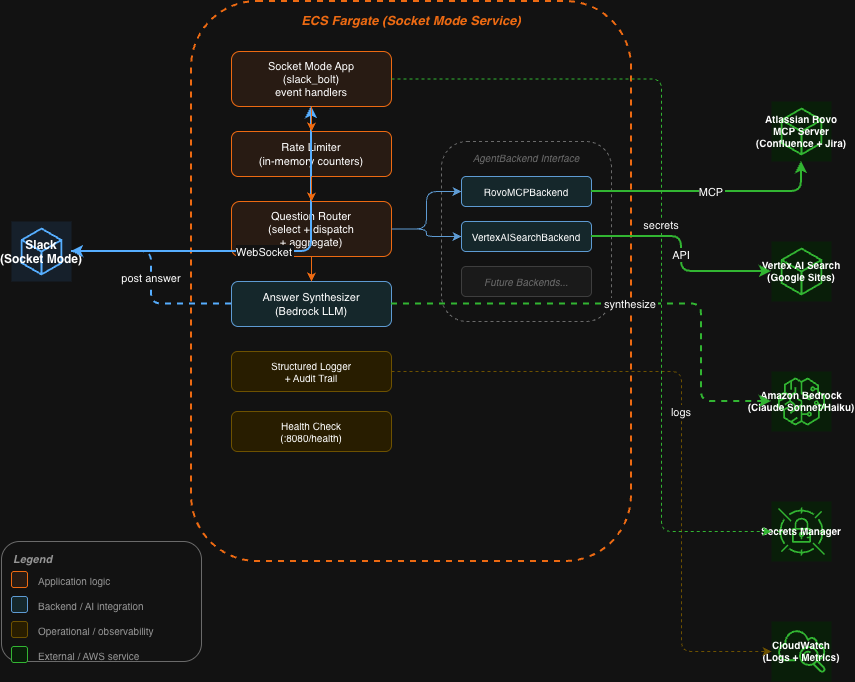
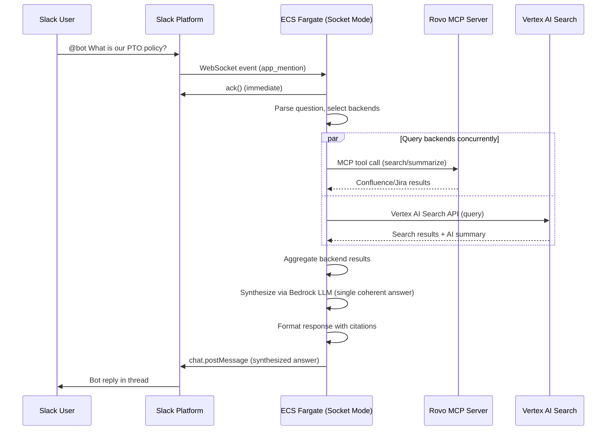
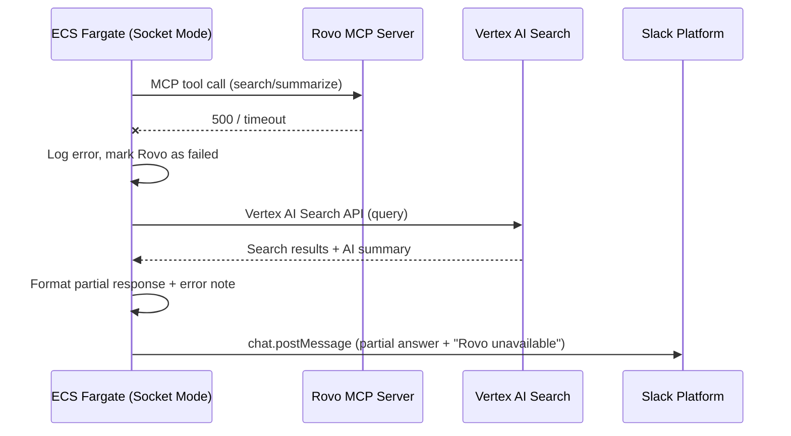
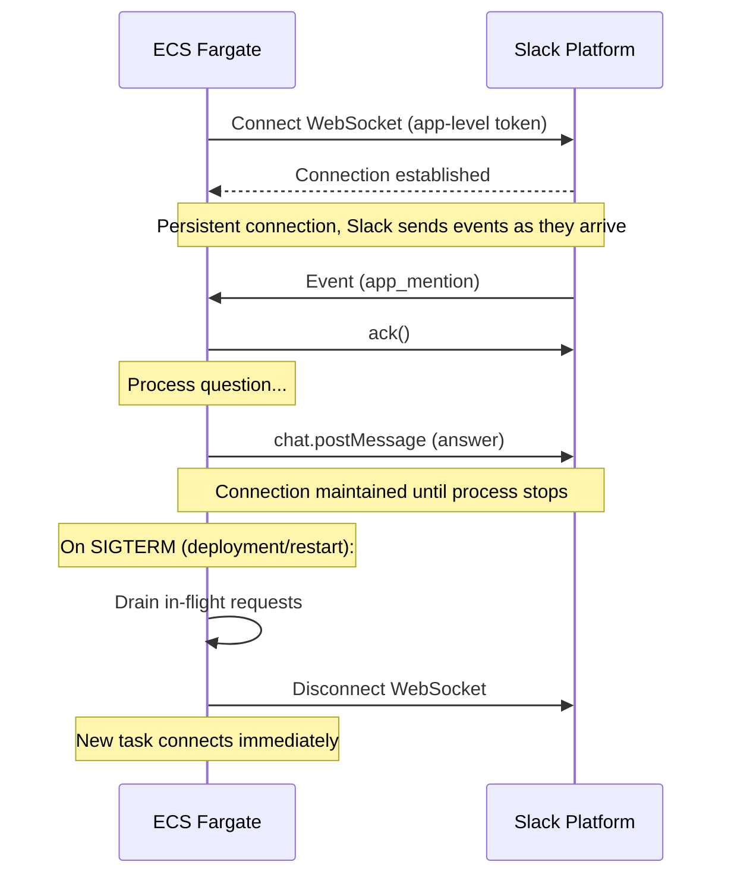

# Design Document: Slack Agent Router

## Overview

The Slack Agent Router is a chatbot for Sage Bionetworks employees that receives questions via Slack (app mentions, DMs, or slash commands) and routes them to external AI agents and data sources to produce answers. Unlike a custom RAG pipeline, this system delegates intelligence to existing backends — Atlassian Rovo for Confluence/Jira knowledge and Google Vertex AI Search for company website content (Google Sites) — then formats and returns the combined response in Slack.

The architecture uses Slack Socket Mode to receive events over a persistent WebSocket connection, eliminating the need for a public HTTP endpoint. A single ECS Fargate service handles event reception, backend routing, and response posting. This makes the system simple to operate, secure by default (no public attack surface), and straightforward to extend with new backends.

The architecture follows a plugin-based router pattern where each backend is an independent agent behind a common interface. This makes it straightforward to add new backends (e.g., GitHub, Snowflake, PowerDMS, Slack, Synapse, etc.) without modifying the core routing logic. The router trusts each backend to handle its own knowledge retrieval and AI reasoning, then uses an LLM (Amazon Bedrock) to synthesize a single coherent answer from the combined backend results.

## Architecture




### Why Socket Mode?

- **No public endpoint** — Slack pushes events over a WebSocket connection initiated by the bot. No API Gateway, no public URL, no attack surface to defend.
- **Simpler architecture** — One ECS Fargate service replaces API Gateway + Ingress Lambda + SQS + Router Lambda. Less infrastructure to build, deploy, and monitor.
- **Secure by default** — No need for WAF, IP restrictions, or signature verification. The WebSocket connection is authenticated by Slack using an app-level token.
- **Good fit for this workload** — Backend queries are lightweight HTTP calls (Rovo + Vertex AI Search), not heavy compute. A single process handles everything.

### Slack's 3-Second Acknowledgment

In Socket Mode, the `slack_bolt` library automatically acknowledges **event envelopes** (for example, `app_mention` and `message` events). When an event arrives over the WebSocket, Bolt sends an `ack()` response immediately before your handler runs, which satisfies Slack's 3-second requirement without any special async architecture. However, **interactive payloads** such as slash commands, button clicks, and modal submissions still require your handler to call `ack()` explicitly within 3 seconds. In all cases, the handler then processes the question and posts the answer asynchronously.


## Sequence Diagrams

### Main Flow: Question → Answer



### Error Flow: Backend Failure



### Connection Lifecycle




## Components and Interfaces

### Component 1: Socket Mode Application

**Purpose**: Maintains the WebSocket connection to Slack, receives events, acknowledges them immediately, and dispatches questions to the router for async processing.

**Interface**:
```python
from slack_bolt.async_app import AsyncApp
from slack_bolt.adapter.socket_mode.async_handler import AsyncSocketModeHandler


class SlackAgentApp:
    """Main application using Slack Bolt with async Socket Mode."""

    def __init__(
        self,
        bot_token: str,
        app_token: str,
        router: "QuestionRouter",
    ):
        self.app = AsyncApp(token=bot_token)
        self.handler = AsyncSocketModeHandler(self.app, app_token)
        self._router = router
        self._register_handlers()

    def _register_handlers(self) -> None:
        """Register event handlers for mentions, DMs, and slash commands."""
        self.app.event("app_mention")(self._handle_mention)
        self.app.event("message")(self._handle_dm)
        self.app.command("/sage-ask")(self._handle_slash_command)

    async def _handle_mention(self, event: dict, say: callable) -> None:
        """Handle @bot mentions in channels."""
        ...

    async def _handle_dm(self, event: dict, say: callable) -> None:
        """Handle direct messages to the bot."""
        ...

    async def _handle_slash_command(self, ack: callable, command: dict, say: callable) -> None:
        """Handle /sage-ask slash command."""
        ...

    async def start(self) -> None:
        """Start the async Socket Mode connection."""
        await self.handler.start_async()

    async def stop(self) -> None:
        """Gracefully disconnect and drain in-flight requests."""
        await self.handler.close_async()
```

**Responsibilities**:
- Maintain persistent WebSocket connection to Slack via Socket Mode
- Acknowledge events immediately (handled by `slack_bolt` automatically)
- Parse `app_mention` and `message` Events API events (including DMs, filtered via `channel_type="im"`)
- Handle slash command payloads from the Commands API and explicitly call `ack()` within 3 seconds
- Strip bot mention prefix from message text
- Add a reaction to indicate the question is being processed
- Dispatch to the QuestionRouter for backend queries
- Handle graceful shutdown on SIGTERM (drain in-flight requests)
- Reconnect automatically on WebSocket disconnection
- Enforce per-user rate limits before dispatching to the router

### Component 2: Question Router

**Purpose**: Determines which backends to query, dispatches queries concurrently, aggregates results, and returns the formatted answer.

**Interface**:
```python
from dataclasses import dataclass
from abc import ABC, abstractmethod


@dataclass(frozen=True)
class BackendResult:
    """Result from a single backend query."""
    backend_name: str
    success: bool
    answer: str | None
    source_urls: list[str]
    error_message: str | None
    latency_ms: float


@dataclass(frozen=True)
class AggregatedResponse:
    """Combined response from all queried backends."""
    results: list[BackendResult]
    formatted_text: str
    formatted_blocks: list[dict]


class QuestionRouter:
    """Routes questions to backends and aggregates responses."""

    def __init__(self, backends: list["AgentBackend"], synthesizer: "AnswerSynthesizer"):
        ...

    def select_backends(self, question: str) -> list["AgentBackend"]:
        """MVP: query all registered backends for every question."""
        ...

    async def dispatch(self, question: str, backends: list["AgentBackend"]) -> list[BackendResult]:
        """Query selected backends concurrently with timeout."""
        ...

    async def aggregate(self, results: list[BackendResult]) -> AggregatedResponse:
        """Combine backend results into a single formatted Slack message.

        Passes raw backend results to the AnswerSynthesizer which uses
        an LLM to produce a single coherent answer with citations.
        """
        ...

    async def handle(self, question: str) -> AggregatedResponse:
        """Main entry point. Select backends, dispatch, aggregate."""
        ...
```

### Component 3: Agent Backend (Abstract Interface)

**Purpose**: Common interface that all backend integrations implement.

**Interface**:
```python
from abc import ABC, abstractmethod


class AgentBackend(ABC):
    """Abstract base class for all agent backends."""

    @property
    @abstractmethod
    def name(self) -> str:
        ...

    @abstractmethod
    async def query(self, question: str) -> BackendResult:
        ...

    @abstractmethod
    async def health_check(self) -> bool:
        ...
```

### Component 4: Rovo MCP Backend

**Purpose**: Queries Atlassian's Rovo MCP Server to search and summarize Confluence and Jira content. Uses the MCP protocol over HTTPS with API token authentication.

**Interface**:
```python
class RovoMCPBackend(AgentBackend):
    """Atlassian Rovo MCP Server integration."""

    def __init__(self, mcp_server_url: str, api_token: str, cloud_id: str):
        """
        Args:
            mcp_server_url: Rovo MCP endpoint (https://mcp.atlassian.com/v1/mcp)
            api_token: Atlassian API token (from Secrets Manager)
            cloud_id: Atlassian Cloud instance ID
        """
        ...

    @property
    def name(self) -> str:
        return "Atlassian Rovo (Confluence/Jira)"

    async def query(self, question: str) -> BackendResult:
        """Search and summarize Confluence/Jira content via Rovo MCP Server."""
        ...

    async def health_check(self) -> bool:
        ...
```

**Responsibilities**:
- Connect to the Rovo MCP Server at `https://mcp.atlassian.com/v1/mcp`
- Authenticate using Atlassian API token (stored in Secrets Manager)
- Use the official `mcp` Python SDK's `ClientSession` with Streamable HTTP transport to connect to the Rovo MCP Server
- Use MCP tool calls (`call_tool`) to search Confluence and Jira content
- Parse MCP responses and extract answer text and source links
- Handle MCP-specific errors (auth failures, rate limits, timeouts)
- Access is scoped to what the API token owner can see — use a dedicated service account for broad access

### Component 5: Vertex AI Search Backend

**Purpose**: Searches the Sage Bionetworks Google Sites company website via Vertex AI Search.

**Interface**:
```python
class VertexAISearchBackend(AgentBackend):
    """Google Sites search via Vertex AI Search."""

    def __init__(
        self,
        project_id: str,
        location: str,
        data_store_id: str,
        service_account_credentials: dict,
    ):
        ...

    @property
    def name(self) -> str:
        return "Google Sites (Vertex AI Search)"

    async def query(self, question: str) -> BackendResult:
        """Search Google Sites content via Vertex AI Search."""
        ...

    async def health_check(self) -> bool:
        ...
```


### Component 6: Answer Synthesizer

**Purpose**: Takes raw results from multiple backends and uses an LLM (Amazon Bedrock) to produce a single coherent answer with citations. This avoids presenting users with multiple disconnected answer blocks.

**Interface**:
```python
class AnswerSynthesizer:
    """Synthesizes multiple backend results into a single answer using an LLM."""

    def __init__(
        self,
        model_id: str = "anthropic.claude-3-5-sonnet-20241022-v2:0",
        fallback_model_id: str = "anthropic.claude-3-haiku-20240307-v1:0",
    ):
        """
        Args:
            model_id: Primary Bedrock model ID for synthesis (default: Claude Sonnet)
            fallback_model_id: Fallback model if primary fails (default: Claude Haiku)
        """
        ...

    async def synthesize(
        self,
        question: str,
        results: list[BackendResult],
    ) -> AggregatedResponse:
        """Synthesize backend results into a single answer.

        Constructs a prompt with the original question and all backend
        results, then invokes Bedrock to produce a unified answer that:
        - Merges information from all sources into a coherent response
        - Cites which source each piece of information came from
        - Notes any conflicts or disagreements between sources
        - Indicates when information is only available from one source
        - Falls back to simple concatenation if the LLM call fails
        """
        ...

    def _build_prompt(self, question: str, results: list[BackendResult]) -> str:
        """Build the synthesis prompt with grounding rules."""
        ...

    def _parse_response(self, llm_response: str, results: list[BackendResult]) -> AggregatedResponse:
        """Parse LLM output into formatted Slack response with citations."""
        ...
```

**Prompt Template**:
```
You are a helpful assistant that synthesizes answers from multiple knowledge sources.

Given the user's question and answers from different sources below, provide a single
coherent answer that:
1. Merges information from all sources into one clear response
2. Cites the source for each piece of information (e.g., "According to Confluence...")
3. Notes any conflicts between sources
4. Does NOT invent information not present in the source answers
5. If no sources provided useful information, say so clearly

User question: {question}

Source answers:
{formatted_backend_results}

Provide a concise, well-structured answer with citations.
```

**Responsibilities**:
- Build a synthesis prompt from the question and backend results
- Invoke Amazon Bedrock (Claude Sonnet primary, Claude Haiku fallback)
- Parse the LLM response and format for Slack with source citations
- Fall back to simple concatenation if Bedrock fails (graceful degradation)
- Retry Bedrock invocation once with exponential backoff on transient errors
- If primary model (Sonnet) fails, retry with fallback model (Haiku) before falling back to concatenation


### Component 7: Health Check

**Purpose**: Exposes a lightweight HTTP health endpoint for ECS container health checks. Reports whether the Socket Mode connection is active and backends are reachable.

**Interface**:
```python
from aiohttp import web


class HealthCheck:
    """HTTP health check server for ECS container health checks."""

    def __init__(
        self,
        app: "SlackAgentApp",
        backends: list["AgentBackend"],
        port: int = 8080,
    ):
        ...

    async def handle(self, request: web.Request) -> web.Response:
        """Health check endpoint.

        Returns 200 if:
        - Socket Mode WebSocket is connected
        Returns 503 if:
        - WebSocket is disconnected

        Response body includes backend health status (informational,
        does not affect the HTTP status code — a backend being down
        is a degraded state, not unhealthy).
        """
        ...

    async def start(self) -> None:
        """Start the health check HTTP server on the configured port."""
        ...
```

**Response Example** (HTTP 200):
```json
{
  "status": "healthy",
  "websocket": "connected",
  "backends": {
    "Atlassian Rovo": "ok",
    "Google Sites (Vertex AI Search)": "ok"
  }
}
```

**Responsibilities**:
- Run a lightweight HTTP server on port 8080 (configurable)
- Report WebSocket connection status (determines healthy/unhealthy)
- Report backend reachability via `health_check()` calls (informational only)
- Used by ECS container health check (`curl http://localhost:8080/health`)
- Keep the health check fast (<500ms) — use `asyncio.wait_for(backend.health_check(), timeout=0.5)` for each backend to enforce the timeout contract; report timed-out backends as `"timeout"` in the response body


### Component 8: Structured Logger and Audit Trail

**Purpose**: Provides structured logging for operational visibility and an audit trail of all questions, answers, and backend interactions, with logs shipped to CloudWatch using the application’s standard logging configuration.

**Interface**:
```python
from dataclasses import dataclass


@dataclass(frozen=True)
class QueryAuditRecord:
    """Structured audit record for each question-answer cycle."""
    request_id: str
    user_id: str
    channel_id: str
    question: str
    backends_queried: list[str]
    backends_succeeded: list[str]
    backends_failed: list[str]
    synthesis_model: str | None     # Which Bedrock model was used (or None if fallback to concat)
    answer_length: int              # Character count of final answer
    total_latency_ms: float
    backend_latencies_ms: dict[str, float]
    synthesis_latency_ms: float | None
    rate_limited: bool
    timestamp: str


class AuditLogger:
    """Structured logging and audit trail for all bot interactions."""

    def __init__(self) -> None:
        ...

    def log_question_received(self, request_id: str, user_id: str, question: str) -> None:
        """Log when a question is received (INFO level)."""
        ...

    def log_backend_result(self, request_id: str, backend_name: str, success: bool, latency_ms: float) -> None:
        """Log individual backend query result (INFO level)."""
        ...

    def log_synthesis_result(self, request_id: str, model_id: str, success: bool, latency_ms: float) -> None:
        """Log LLM synthesis result (INFO level)."""
        ...

    def log_answer_posted(self, record: QueryAuditRecord) -> None:
        """Log the complete audit record when answer is posted (INFO level)."""
        ...

    def log_rate_limited(self, request_id: str, user_id: str, reason: str) -> None:
        """Log when a request is rate-limited (WARNING level)."""
        ...

    def log_error(self, request_id: str, component: str, error: Exception) -> None:
        """Log errors with full context (ERROR level)."""
        ...
```

**Logging Rules**:
- Use structured JSON logging (key-value pairs) for machine-parseable output
- Include `request_id` in every log entry for correlation
- Never log API tokens, secrets, or credentials
- Never log full backend response bodies (may contain sensitive content) — log metadata only
- Set log level to INFO in production, DEBUG in development

**CloudWatch Integration**:
- All logs go to a CloudWatch Log Group (`/ecs/slack-agent-router`)
- Use CloudWatch Logs Insights for querying audit records
- Create metric filters for: question count, error rate, rate-limited count, backend failure count
- Retention: 90 days (configurable)

**Responsibilities**:
- Emit structured JSON logs for every question-answer cycle
- Track per-backend latency and success/failure for operational dashboards
- Provide audit trail of who asked what and what was returned
- Support CloudWatch Logs Insights queries for debugging and analytics
- Log rate-limited requests for abuse detection
- Log WebSocket connection/disconnection events


### Component 9: Rate Limiter

**Purpose**: Enforces per-user and global rate limits to prevent abuse and control Bedrock costs. Uses in-memory counters (suitable for a single ECS task).

**Interface**:
```python
from dataclasses import dataclass


@dataclass(frozen=True)
class RateLimitConfig:
    """Rate limit thresholds."""
    per_user_per_minute: int = 5
    per_user_per_hour: int = 30
    per_user_per_day: int = 100
    per_user_in_flight: int = 1
    global_per_minute: int = 50


class RateLimiter:
    """In-memory rate limiter with sliding window counters."""

    def __init__(self, config: RateLimitConfig | None = None):
        ...

    def check(self, user_id: str) -> tuple[bool, str | None]:
        """Check if a request is allowed.

        Returns:
            (True, None) if allowed.
            (False, reason) if rate-limited, with a user-friendly reason string.
        """
        ...

    def acquire(self, user_id: str) -> None:
        """Record that a request is being processed."""
        ...

    def release(self, user_id: str) -> None:
        """Record that a request has completed (decrement in-flight)."""
        ...
```

**Responsibilities**:
- Track per-user request counts using sliding window counters
- Enforce 1 in-flight request per user (prevent concurrent queries from same user)
- Enforce per-minute, per-hour, and per-day limits per user
- Enforce global per-minute limit across all users
- Return user-friendly messages when limits are exceeded
- Ensure counters naturally decay as time windows slide (logical reset of old buckets)
- Implement a cleanup strategy (e.g., TTL per user key or periodic eviction of inactive users) to avoid unbounded growth of in-memory state
- Note: in-memory counters also reset on task restart — acceptable for MVP but not a substitute for the cleanup strategy above

## Data Models

### Model 1: Parsed Question

```python
@dataclass(frozen=True)
class ParsedQuestion:
    """Normalized question from any Slack input method."""
    event_type: str
    user_id: str
    channel_id: str
    thread_ts: str | None
    question: str
    team_id: str
    event_ts: str
    request_id: str
```

### Model 2: Backend Configuration

```python
@dataclass(frozen=True)
class BackendConfig:
    """Configuration for a single backend."""
    name: str
    enabled: bool
    timeout_seconds: int
    secret_arn: str
```

### Model 3: Slack Response Format

**Response Format Example** (Slack mrkdwn):
```
*Here's what I found:*

PTO policy allows 20 days per year for full-time employees. Requests should be submitted through Workday at least 2 weeks in advance (Employee Handbook). The full policy details, including carryover rules and blackout periods, are documented in the PTO Policy page on Confluence.

*Sources:*
1. <https://confluence.example.com/wiki/pto-policy|PTO Policy Page> (Confluence)
2. <https://sites.google.com/sage.com/handbook/pto|Employee Handbook - PTO> (Google Sites)

_Synthesized from 2 sources in 5.1s_
```


## Error Handling

### Error Scenario 1: WebSocket Disconnection
**Condition**: WebSocket connection to Slack drops.
**Response**: `slack_bolt` automatically reconnects with exponential backoff. Events during the brief gap are lost.
**Recovery**: Automatic. Log disconnection events. CloudWatch alarm on repeated disconnections.

### Error Scenario 2: Single Backend Timeout
**Condition**: One backend doesn't respond within its configured timeout (default 15s).
**Response**: Cancel the timed-out request. Return results from backends that did respond, with a note.
**Recovery**: Next question will try the backend again.

### Error Scenario 3: All Backends Fail
**Condition**: Every backend returns an error or times out.
**Response**: Post: "I wasn't able to find an answer right now. Please try again in a few minutes."
**Recovery**: Log all errors with `request_id`. No automatic retry.

### Error Scenario 4: Slack API Rate Limit
**Condition**: Slack returns HTTP 429 when posting the response.
**Response**: Retry with exponential backoff using `Retry-After` header.
**Recovery**: Up to 3 retries.

### Error Scenario 5: Invalid/Empty Question
**Condition**: User mentions the bot with no question text.
**Response**: Ephemeral message: "Try asking me something like: `@bot What is our PTO policy?`"

### Error Scenario 6: Vertex AI Search API Error
**Condition**: Vertex AI Search returns an error.
**Response**: Return results from other backends. Note: "Google Sites search is temporarily unavailable."
**Recovery**: Log error. Alert on repeated failures.

### Error Scenario 7: Bedrock Synthesis Failure
**Condition**: Bedrock returns an error or times out during LLM synthesis.
**Response**: Retry with fallback model (Claude Haiku). If both models fail, fall back to simple concatenation of backend results (show each answer in its own section, no synthesis). The user still gets answers, just not merged.
**Recovery**: Log which model failed and why. Alert on repeated failures.

### Error Scenario 8: Rate Limit Exceeded
**Condition**: A user exceeds per-user limits (5/min, 30/hr, 100/day, 1 in-flight) or global limit (50/min).
**Response**: Post an ephemeral message: "You're asking questions a bit too fast. Please wait a moment and try again." No backend queries dispatched, no Bedrock invocation.
**Recovery**: Automatic — limits reset as time windows slide.

### Error Scenario 9: ECS Task Crash / Restart
**Condition**: ECS Fargate task crashes or is replaced during deployment.
**Response**: In-flight questions are lost. ECS restarts the task. New WebSocket connection established.
**Recovery**: ECS maintains desired count. Users can re-ask.


## Testing Strategy

### Unit Tests
- `SlackAgentApp`: Event parsing, empty question rejection, bot mention stripping
- `QuestionRouter`: Backend selection, concurrent dispatch, mixed success/failure aggregation
- `RovoMCPBackend`: MCP response parsing, HTTP error handling
- `VertexAISearchBackend`: Search result parsing, credential handling, API errors
- `AnswerSynthesizer`: Prompt construction, LLM response parsing, fallback to concatenation, Bedrock error handling
- `RateLimiter`: Per-user limits, global limits, in-flight tracking, window expiry
- `HealthCheck`: HTTP response codes, WebSocket status reporting, backend health aggregation
- `AuditLogger`: Structured log output, request_id correlation, sensitive data exclusion
- Use `pytest` with `pytest-asyncio`, target 80%+ coverage

### Property-Based Tests (`hypothesis`)
- `select_backends` returns non-empty list for any non-empty question
- `aggregate` produces valid Slack mrkdwn for any combination of results
- Response formatting never exceeds Slack's 3000-character block limit

### Integration Tests
- Backend integration against sandbox instances (Rovo MCP Server with test credentials, Vertex AI test data store)
- Slack message posting with a dedicated test channel
- WebSocket reconnection behavior


## Application Entrypoint

The `main.py` entrypoint ties all components together on a single asyncio event loop: Socket Mode listener, health check server, and graceful shutdown via signal handlers.

```python
import asyncio
import signal
from functools import partial


async def main() -> None:
    # Load secrets from Secrets Manager
    secrets = await load_secrets()

    # Initialize backends
    backends = [
        RovoMCPBackend(
            mcp_server_url="https://mcp.atlassian.com/v1/mcp",
            api_token=secrets["atlassian_api_token"],
            cloud_id=secrets["atlassian_cloud_id"],
        ),
        VertexAISearchBackend(
            project_id=secrets["gcp_project_id"],
            location="global",
            data_store_id=secrets["vertex_data_store_id"],
            service_account_credentials=secrets["gcp_service_account"],
        ),
    ]

    # Initialize components
    synthesizer = AnswerSynthesizer()
    rate_limiter = RateLimiter()
    router = QuestionRouter(backends=backends, synthesizer=synthesizer)
    app = SlackAgentApp(
        bot_token=secrets["slack_bot_token"],
        app_token=secrets["slack_app_token"],
        router=router,
        rate_limiter=rate_limiter,
    )
    health = HealthCheck(app=app, backends=backends)

    # Register graceful shutdown
    loop = asyncio.get_running_loop()
    shutdown = partial(_shutdown, app=app, health=health)
    loop.add_signal_handler(signal.SIGTERM, lambda: loop.create_task(shutdown()))
    loop.add_signal_handler(signal.SIGINT, lambda: loop.create_task(shutdown()))

    # Start health check and Socket Mode concurrently
    await asyncio.gather(
        health.start(),
        app.start(),
    )


async def _shutdown(app: SlackAgentApp, health: HealthCheck) -> None:
    """Drain in-flight requests and disconnect."""
    await app.stop()
    # Health check server stops with the process


if __name__ == "__main__":
    asyncio.run(main())
```

This ensures the WebSocket listener, health check HTTP server, and signal handlers all share the same event loop.


## Performance Considerations

- **Concurrent backend queries**: `asyncio.gather` — total latency = slowest backend
- **ECS task sizing**: 0.25 vCPU, 0.5 GB memory (sufficient for HTTP calls)
- **Timeouts**: 15s per backend, 10s for LLM synthesis, 30s total question handling
- **Performance budget**: Median < 10s, p95 < 18s (backend queries ~3-8s + LLM synthesis ~2-5s)
- **Connection stability**: `slack_bolt` handles keepalive and reconnection automatically
- **Graceful shutdown**: Register `SIGTERM` and `SIGINT` handlers via `asyncio.get_event_loop().add_signal_handler()` to drain in-flight requests before disconnecting the WebSocket. ECS sends `SIGTERM` with a configurable stop timeout (default 30s) before force-killing the task — ensure in-flight questions complete or are abandoned within that window.


## Security Considerations

- **No public inbound HTTP endpoint**: Socket Mode uses an outbound WebSocket connection. Only an internal/container-local HTTP health check is exposed; no public URL is reachable from the internet.
- **Secret management**: All tokens in AWS Secrets Manager. Never in env vars or code.
- **Least privilege IAM**: ECS task role gets only `secretsmanager:GetSecretValue`, `bedrock:InvokeModel`, and `logs:PutLogEvents`.
- **Audit logging**: Structured JSON logs to CloudWatch include question text, backend results metadata, and latency. Logs retained for 90 days. No full backend response bodies logged. No secrets or credentials in logs.
- **No persistent data store**: No database. Audit records live in CloudWatch Logs only. Questions and answers not stored beyond log retention.
- **GCP service account scoping**: `discoveryengine.viewer` role only, scoped to the data store.
- **Input sanitization**: Strip Slack formatting before sending to backends. Sanitize responses before posting.


## Dependencies

### Python Packages
- `slack-bolt` — Slack Bolt framework with Socket Mode support
- `slack-sdk` — Slack Web API client
- `httpx` — Async HTTP client for MCP and API calls
- `aiohttp` — Lightweight HTTP server for health check endpoint
- `mcp` — Official MCP Python SDK (includes `ClientSession` for connecting to MCP servers as a client)
- `google-cloud-discoveryengine` — Vertex AI Search client library
- `google-auth` — GCP service account authentication
- `pydantic` — Input validation and settings management
- `boto3` — AWS SDK (Secrets Manager, Bedrock Runtime)

### AWS Services
- ECS Fargate — Socket Mode listener (always-on, 1 task minimum)
- Amazon Bedrock — LLM synthesis (Claude Sonnet primary, Claude Haiku fallback)
- Secrets Manager — API tokens and credentials
- CloudWatch — Logs, metrics, alarms
- CDK (Python) — Infrastructure as code

### External Services
- Slack API — Socket Mode WebSocket, Web API for posting messages
- Atlassian Rovo MCP Server (`mcp.atlassian.com`) — Search and summarize Confluence/Jira content via MCP protocol
- Vertex AI Search API — Managed search over Google Sites content
- Google Cloud Platform — Service account auth, Vertex AI Search hosting
