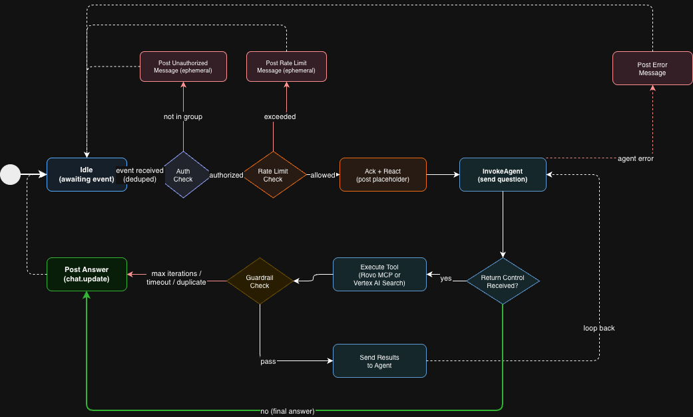
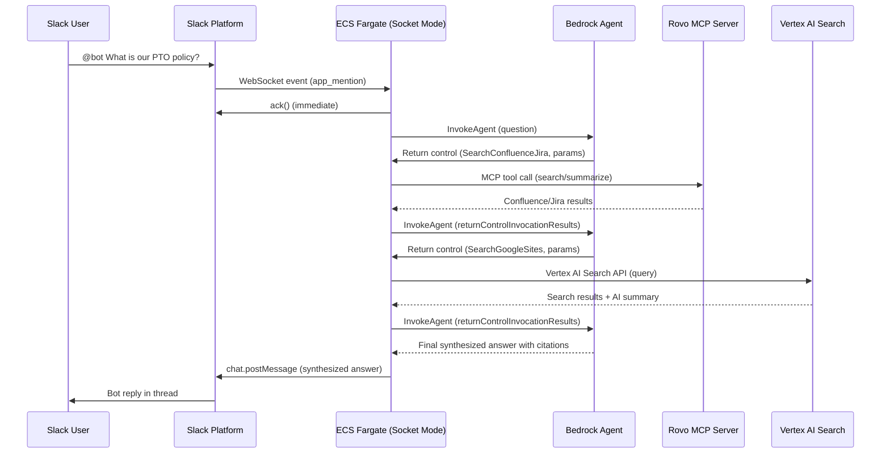
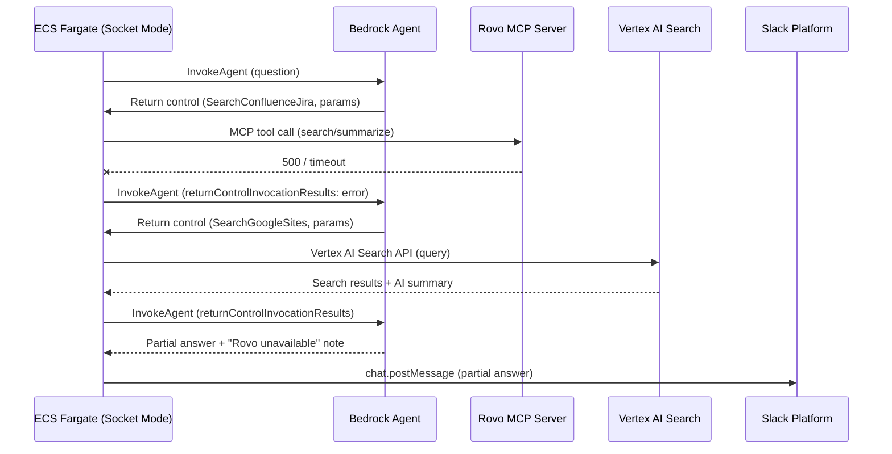
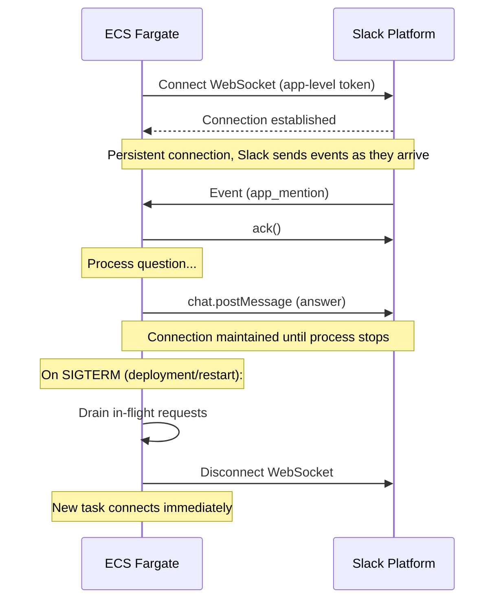

# Design Document: Slack Agent Router

## Overview

The Slack Agent Router is a chatbot for Sage Bionetworks employees that receives questions via Slack (app mentions, DMs, or slash commands) and uses a managed Amazon Bedrock Agent to route questions to external knowledge sources, synthesize results, and return coherent, cited answers.

The Bedrock Agent acts as the brain of the system — it decides which knowledge sources to query for each question, orchestrates the tool calls via the return control pattern, and synthesizes a single answer from the combined results. The application code handles Slack interaction, backend API execution, and operational concerns (rate limiting, health checks, logging). This separation means routing logic, prompt engineering, and answer synthesis are managed by Bedrock, while backend integrations and infrastructure are managed by our code.

For MVP, two knowledge backends are configured as Bedrock Agent action groups:
- Atlassian Rovo MCP Server — searches Confluence and Jira content
- Google Vertex AI Search — searches the company Google Sites website

The architecture uses Slack Socket Mode to receive events over a persistent WebSocket connection, eliminating the need for a public HTTP endpoint. A single ECS Fargate service handles event reception, Bedrock Agent interaction, backend execution, and response posting. This makes the system simple to operate, secure by default (no public attack surface), and straightforward to extend.

Adding a new backend means creating a new `RETURN_CONTROL` action group on the Bedrock Agent and adding a corresponding backend class in the application code. The Bedrock Agent automatically incorporates the new tool into its routing decisions — no custom routing logic needed.

## Architecture


### Why Socket Mode?

- **No public endpoint** — Slack pushes events over a WebSocket connection initiated by the bot. No API Gateway, no public URL, no attack surface to defend.
- **Simpler architecture** — One ECS Fargate service replaces API Gateway + Ingress Lambda + SQS + Router Lambda. Less infrastructure to build, deploy, and monitor.
- **Secure by default** — No need for WAF, IP restrictions, or signature verification. The WebSocket connection is authenticated by Slack using an app-level token.
- **Good fit for this workload** — Backend queries are lightweight HTTP calls (Rovo + Vertex AI Search), not heavy compute. A single process handles everything.

### Slack's 3-Second Acknowledgment

In Socket Mode, the `slack_bolt` library automatically acknowledges **event envelopes** (for example, `app_mention` and `message` events). When an event arrives over the WebSocket, Bolt sends an `ack()` response immediately before your handler runs, which satisfies Slack's 3-second requirement without any special async architecture. However, **interactive payloads** such as slash commands, button clicks, and modal submissions still require your handler to call `ack()` explicitly within 3 seconds. In all cases, the handler then processes the question and posts the answer asynchronously.


## Agent State Machine




## Sequence Diagrams

### Main Flow: Question → Answer



### Error Flow: Backend Failure



### Connection Lifecycle




## Components and Interfaces

### Component 1: Socket Mode Application

**Purpose**: Maintains the WebSocket connection to Slack, receives events, acknowledges them immediately, and dispatches questions to the agents for async processing.

**Interface**:
```python
from slack_bolt.async_app import AsyncApp
from slack_bolt.adapter.socket_mode.async_handler import AsyncSocketModeHandler


class SlackAgentApp:
    """Main application using Slack Bolt with async Socket Mode."""

    def __init__(
        self,
        bot_token: str,
        app_token: str,
        orchestrator: "BedrockAgentOrchestrator",
    ):
        self.app = AsyncApp(token=bot_token)
        self.handler = AsyncSocketModeHandler(self.app, app_token)
        self._orchestrator = orchestrator
        self._register_handlers()

    def _register_handlers(self) -> None:
        """Register event handlers for mentions, DMs, and slash commands."""
        self.app.event("app_mention")(self._handle_mention)
        self.app.event("message")(self._handle_dm)
        self.app.command("/sage-ask")(self._handle_slash_command)

    async def _handle_mention(self, event: dict, say: callable) -> None:
        """Handle @bot mentions in channels."""
        ...

    async def _handle_dm(self, event: dict, say: callable) -> None:
        """Handle direct messages to the bot."""
        ...

    async def _handle_slash_command(self, ack: callable, command: dict, say: callable) -> None:
        """Handle /sage-ask slash command."""
        ...

    async def start(self) -> None:
        """Start the async Socket Mode connection."""
        await self.handler.start_async()

    async def stop(self) -> None:
        """Gracefully disconnect and drain in-flight requests."""
        await self.handler.close_async()
```

**Responsibilities**:
- Maintain persistent WebSocket connection to Slack via Socket Mode
- Acknowledge events immediately (handled by `slack_bolt` automatically)
- Parse `app_mention` and `message` Events API events (including DMs, filtered via `channel_type="im"`)
- Handle slash command payloads from the Commands API and explicitly call `ack()` within 3 seconds
- Strip bot mention prefix from message text
- Provide progressive feedback to the user:
  1. Immediately add 👀 (eyes) reaction to the user's message (~0-1s)
  2. Post a placeholder message with ⏳ and a generic searching indicator, e.g., "⏳ Thinking..." (~1-3s). Update the message as each tool is invoked during the return control loop, e.g., "⏳ Searching Confluence and Jira..." → "⏳ Searching Google Sites..."
  3. Update the placeholder message with the final synthesized answer via `chat.update` when complete
  4. Remove the 👀 reaction and add ✅ when the answer is posted
- Dispatch to the BedrockAgentOrchestrator for processing
- Handle graceful shutdown on SIGTERM (drain in-flight requests)
- Reconnect automatically on WebSocket disconnection
- Enforce per-user rate limits before dispatching to the Bedrock Agent
- Deduplicate events to prevent duplicate answers:
  - Track recently processed Slack event IDs (`event_id` or envelope `envelope_id`) in an in-memory TTL cache (e.g., 60s window)
  - If an event ID has already been seen, skip processing silently
  - For slash commands: Slack may retry if ack is slow — deduplicate on `trigger_id`
  - For message posting: before calling `chat.postMessage`, check if a reply already exists in the thread for this `request_id` to prevent duplicate answers on retries
  - Note: in-memory cache resets on task restart — brief window for duplicates during restarts, acceptable for MVP

### Component 2: Bedrock Agent (Managed Orchestrator)

**Purpose**: Replaces the custom Question Router and Answer Synthesizer with a managed Amazon Bedrock Agent. The agent handles question routing, backend tool selection, answer synthesis, and citation formatting — all managed by Bedrock's orchestration engine. Uses the return control feature so that backend API calls are executed by our application code, not by Lambda functions.

**How it works**:
1. The Socket Mode app sends the user's question to the Bedrock Agent via `InvokeAgent`
2. The agent decides which action groups (tools) to call based on the question
3. Instead of calling a Lambda, the agent returns control to our application with the tool name and parameters (`RETURN_CONTROL`)
4. Our application executes the backend call (Rovo MCP, Vertex AI Search) and sends the results back to the agent via another `InvokeAgent` call with `returnControlInvocationResults`
5. The agent synthesizes a final answer from the tool results and returns it
6. Our application formats and posts the answer to Slack

**Agent Configuration**:
- Model: Claude Sonnet (primary) via Bedrock
- Action Groups:
  - `SearchConfluenceJira` — configured with `RETURN_CONTROL`, describes searching Confluence and Jira via Rovo
  - `SearchGoogleSites` — configured with `RETURN_CONTROL`, describes searching the company Google Sites website
- Agent instructions: grounding rules, citation requirements, conflict handling, refusal when no information found

**Interface**:
```python
from dataclasses import dataclass


@dataclass(frozen=True)
class AgentResponse:
    """Response from the Bedrock Agent."""
    answer: str                # Synthesized answer text
    source_urls: list[str]     # Cited source links
    tool_calls_made: list[str] # Which action groups were invoked
    latency_ms: float


class BedrockAgentOrchestrator:
    """Manages interaction with the Amazon Bedrock Agent using return control."""

    def __init__(
        self,
        agent_id: str,
        agent_alias_id: str,
        rovo_backend: "RovoMCPBackend",
        vertex_backend: "VertexAISearchBackend",
    ):
        """
        Args:
            agent_id: Bedrock Agent ID
            agent_alias_id: Bedrock Agent alias ID
            rovo_backend: Backend for executing Rovo MCP calls
            vertex_backend: Backend for executing Vertex AI Search calls
        """
        ...

    async def ask(self, question: str, session_id: str) -> AgentResponse:
        """Send a question to the Bedrock Agent and handle the return control loop.

        1. Call InvokeAgent with the question
        2. If agent returns control with tool invocation requests:
           a. Execute the requested backend calls locally
           b. Send results back via InvokeAgent with returnControlInvocationResults
           c. Repeat until agent returns a final answer
        3. Parse and return the synthesized answer

        Guardrails:
        - Max 5 return control iterations per question (prevents infinite loops)
        - 30s total timeout for the entire ask() call
        - Duplicate tool call detection: skip if same action group + parameters
          were already executed in this loop (prevents repeated searches)
        - If any guardrail is hit, return the best partial answer available
          or a "couldn't complete" message
        """
        ...

    async def _execute_tool(self, action_group: str, function_name: str, parameters: dict) -> "ToolOutput":
        """Execute a backend call and convert the result for the Bedrock Agent.

        1. Map action_group to the appropriate backend
        2. Call backend.query() which returns a BackendResult
        3. Convert BackendResult to ToolOutput for returnControlInvocationResults
        """
        ...

    def _parse_final_response(self, response: dict) -> AgentResponse:
        """Extract the synthesized answer and citations from the agent's final response."""
        ...
```

**Responsibilities**:
- Invoke the Bedrock Agent with user questions
- Handle the return control loop: receive tool requests, execute them locally, send results back
- Map action group names to backend implementations (Rovo MCP, Vertex AI Search)
- Parse the agent's final synthesized response
- Handle agent errors (throttling, timeout, invalid response)
- Maintain session context per Slack thread (using `session_id` derived from `thread_ts`)

**Session ID Strategy**:
- Thread reply: `session_id` = `{channel_id}:{thread_ts}` — all replies in the same thread share a Bedrock Agent session for conversational context
- Channel mention without existing thread: `session_id` = `{channel_id}:{message_ts}` — the bot's reply starts a new thread, and the message timestamp becomes the thread anchor
- DM with no thread: `session_id` = `{channel_id}:{message_ts}` — each top-level DM starts a fresh session
- Session expiration: Bedrock Agent sessions expire after 1 hour of inactivity (Bedrock default). If a user returns to a thread after the session has expired, the orchestrator starts a fresh session — the user may need to re-state context. This is acceptable for MVP.

**Why return control instead of Lambda?**:
- Keeps backend execution in our application code — no separate Lambda functions to deploy and manage
- Backends (Rovo MCP, Vertex AI Search) need credentials already loaded in the ECS task
- Simpler deployment — one container handles everything
- Easier to test — mock the Bedrock Agent API, test backend execution directly

### Backend Result Model

Both backends return a common `BackendResult` that the orchestrator converts to a `ToolOutput` (Model 3) before sending to the Bedrock Agent.

```python
@dataclass(frozen=True)
class BackendResult:
    """Internal result from a backend query. Not sent to Bedrock directly."""
    backend_name: str
    success: bool
    answer: str | None        # The answer text or search results
    source_urls: list[str]    # Links to source documents
    error_message: str | None # Error details if success=False
    latency_ms: float
```

The `BedrockAgentOrchestrator._execute_tool` method calls the appropriate backend, receives a `BackendResult`, and converts it to a `ToolOutput` for serialization into the Bedrock Agent's `returnControlInvocationResults`.

### Component 3: Rovo MCP Backend

**Purpose**: Queries Atlassian's Rovo MCP Server to search and summarize Confluence and Jira content. Uses the MCP protocol over HTTPS with API token authentication.

**Interface**:
```python
class RovoMCPBackend:
    """Atlassian Rovo MCP Server integration."""

    def __init__(self, mcp_server_url: str, api_token: str, cloud_id: str):
        """
        Args:
            mcp_server_url: Rovo MCP endpoint (https://mcp.atlassian.com/v1/mcp)
            api_token: Atlassian API token (from Secrets Manager)
            cloud_id: Atlassian Cloud instance ID
        """
        ...

    @property
    def name(self) -> str:
        return "Atlassian Rovo (Confluence/Jira)"

    async def query(self, question: str) -> BackendResult:
        """Search and summarize Confluence/Jira content via Rovo MCP Server."""
        ...

    async def health_check(self) -> bool:
        ...
```

**Responsibilities**:
- Connect to the Rovo MCP Server at `https://mcp.atlassian.com/v1/mcp`
- Authenticate using Atlassian API token (stored in Secrets Manager)
- Use the official `mcp` Python SDK's `ClientSession` with Streamable HTTP transport to connect to the Rovo MCP Server
- Use MCP tool calls (`call_tool`) to search Confluence and Jira content
- Parse MCP responses and extract answer text and source links
- Handle MCP-specific errors (auth failures, rate limits, timeouts)
- Access is scoped to what the API token owner can see — use a dedicated service account for broad access

### Component 4: Vertex AI Search Backend

**Purpose**: Searches the Sage Bionetworks Google Sites company website via Vertex AI Search.

**Interface**:
```python
class VertexAISearchBackend:
    """Google Sites search via Vertex AI Search."""

    def __init__(
        self,
        project_id: str,
        location: str,
        data_store_id: str,
        service_account_credentials: dict,
    ):
        ...

    @property
    def name(self) -> str:
        return "Google Sites (Vertex AI Search)"

    async def query(self, question: str) -> BackendResult:
        """Search Google Sites content via Vertex AI Search."""
        ...

    async def health_check(self) -> bool:
        ...
```


### Component 5: Health Check

**Purpose**: Exposes a lightweight HTTP health endpoint for ECS container health checks. Reports whether the Socket Mode connection is active and backends are reachable.

**Interface**:
```python
from aiohttp import web


class HealthCheck:
    """HTTP health check server for ECS container health checks."""

    def __init__(
        self,
        app: "SlackAgentApp",
        backends: list,
        port: int = 8080,
    ):
        ...

    async def handle(self, request: web.Request) -> web.Response:
        """Health check endpoint.

        Returns 200 if:
        - Socket Mode WebSocket is connected
        Returns 503 if:
        - WebSocket is disconnected

        Response body includes backend health status (informational,
        does not affect the HTTP status code — a backend being down
        is a degraded state, not unhealthy).
        """
        ...

    async def start(self) -> None:
        """Start the health check HTTP server on the configured port."""
        ...
```

**Response Example** (HTTP 200):
```json
{
  "status": "healthy",
  "websocket": "connected",
  "backends": {
    "Atlassian Rovo": "ok",
    "Google Sites (Vertex AI Search)": "ok"
  }
}
```

**Responsibilities**:
- Run a lightweight HTTP server on port 8080 (configurable)
- Report WebSocket connection status (determines healthy/unhealthy)
- Report backend reachability via `health_check()` calls (informational only)
- Used by ECS container health check (`curl http://localhost:8080/health`)
- Keep the health check fast (<500ms) — use `asyncio.wait_for(backend.health_check(), timeout=0.5)` for each backend to enforce the timeout contract; report timed-out backends as `"timeout"` in the response body


### Component 6: Structured Logger and Audit Trail

**Purpose**: Provides structured logging for operational visibility and an audit trail of all questions, answers, and backend interactions, with logs shipped to CloudWatch using the application’s standard logging configuration.

**Interface**:
```python
from dataclasses import dataclass


@dataclass(frozen=True)
class QueryAuditRecord:
    """Structured audit record for each question-answer cycle."""
    request_id: str
    user_id: str
    channel_id: str
    question: str
    backends_queried: list[str]
    backends_succeeded: list[str]
    backends_failed: list[str]
    agent_model: str | None     # Bedrock Agent model used for orchestration
    answer_length: int              # Character count of final answer
    total_latency_ms: float
    backend_latencies_ms: dict[str, float]
    agent_latency_ms: float | None  # Total Bedrock Agent orchestration time (all InvokeAgent calls)
    rate_limited: bool
    timestamp: str


class AuditLogger:
    """Structured logging and audit trail for all bot interactions."""

    def __init__(self) -> None:
        ...

    def log_question_received(self, request_id: str, user_id: str, question: str) -> None:
        """Log when a question is received (INFO level)."""
        ...

    def log_backend_result(self, request_id: str, backend_name: str, success: bool, latency_ms: float) -> None:
        """Log individual backend query result (INFO level)."""
        ...

    def log_agent_result(self, request_id: str, success: bool, latency_ms: float, iterations: int) -> None:
        """Log Bedrock Agent orchestration result (INFO level)."""
        ...

    def log_answer_posted(self, record: QueryAuditRecord) -> None:
        """Log the complete audit record when answer is posted (INFO level)."""
        ...

    def log_rate_limited(self, request_id: str, user_id: str, reason: str) -> None:
        """Log when a request is rate-limited (WARNING level)."""
        ...

    def log_error(self, request_id: str, component: str, error: Exception) -> None:
        """Log errors with full context (ERROR level)."""
        ...
```

**Logging Rules**:
- Use structured JSON logging (key-value pairs) for machine-parseable output
- Include `request_id` in every log entry for correlation
- Never log API tokens, secrets, or credentials
- Never log full backend response bodies (may contain sensitive content) — log metadata only
- Set log level to INFO in production, DEBUG in development

**CloudWatch Integration**:
- All logs go to a CloudWatch Log Group (`/ecs/slack-agent-router`)
- Use CloudWatch Logs Insights for querying audit records
- Create metric filters for: question count, error rate, rate-limited count, backend failure count
- Retention: 90 days (configurable)

**Responsibilities**:
- Emit structured JSON logs for every question-answer cycle
- Track per-backend latency and success/failure for operational dashboards
- Provide audit trail of who asked what and what was returned
- Support CloudWatch Logs Insights queries for debugging and analytics
- Log rate-limited requests for abuse detection
- Log WebSocket connection/disconnection events


### Component 7: Rate Limiter

**Purpose**: Enforces per-user and global rate limits to prevent abuse and control Bedrock costs. Uses in-memory counters (suitable for a single ECS task).

**Interface**:
```python
from dataclasses import dataclass


@dataclass(frozen=True)
class RateLimitConfig:
    """Rate limit thresholds."""
    per_user_per_minute: int = 5
    per_user_per_hour: int = 30
    per_user_per_day: int = 100
    per_user_in_flight: int = 1
    global_per_minute: int = 50


class RateLimiter:
    """In-memory rate limiter with sliding window counters."""

    def __init__(self, config: RateLimitConfig | None = None):
        ...

    def check(self, user_id: str) -> tuple[bool, str | None]:
        """Check if a request is allowed.

        Returns:
            (True, None) if allowed.
            (False, reason) if rate-limited, with a user-friendly reason string.
        """
        ...

    def acquire(self, user_id: str) -> None:
        """Record that a request is being processed."""
        ...

    def release(self, user_id: str) -> None:
        """Record that a request has completed (decrement in-flight)."""
        ...
```

**Responsibilities**:
- Track per-user request counts using sliding window counters
- Enforce 1 in-flight request per user (prevent concurrent queries from same user)
- Enforce per-minute, per-hour, and per-day limits per user
- Enforce global per-minute limit across all users
- Return user-friendly messages when limits are exceeded
- Ensure counters naturally decay as time windows slide (logical reset of old buckets)
- Implement a cleanup strategy (e.g., TTL per user key or periodic eviction of inactive users) to avoid unbounded growth of in-memory state
- Note: in-memory counters also reset on task restart — acceptable for MVP but not a substitute for the cleanup strategy above

## Data Models

### Model 1: Parsed Question

```python
@dataclass(frozen=True)
class ParsedQuestion:
    """Normalized question from any Slack input method."""
    event_type: str
    user_id: str
    channel_id: str
    thread_ts: str | None
    question: str
    team_id: str
    event_ts: str
    request_id: str
```

### Model 2: Backend Configuration

```python
@dataclass(frozen=True)
class BackendConfig:
    """Configuration for a single backend."""
    name: str
    enabled: bool
    timeout_seconds: int
    secret_arn: str
```

### Model 3: Tool Output Structure

The structure returned by each backend and sent back to the Bedrock Agent via `returnControlInvocationResults`. This is what the agent uses to synthesize its final answer.

```python
@dataclass(frozen=True)
class ToolOutput:
    """Structured output from a backend tool execution."""
    success: bool
    content: str              # The answer text or search results (plain text)
    sources: list[dict]       # List of source references
    # Each source: {"title": str, "url": str, "system": str}
    error_message: str | None # Error details if success=False


# Example: successful Rovo MCP result
ToolOutput(
    success=True,
    content="PTO policy allows 20 days per year for full-time employees...",
    sources=[
        {"title": "PTO Policy", "url": "https://confluence.example.com/wiki/pto", "system": "Confluence"},
        {"title": "Leave Tracker", "url": "https://jira.example.com/browse/HR-123", "system": "Jira"},
    ],
    error_message=None,
)

# Example: failed Vertex AI Search result
ToolOutput(
    success=False,
    content="",
    sources=[],
    error_message="Vertex AI Search returned 503: service unavailable",
)
```

**Serialization for Bedrock Agent**: The `ToolOutput` is serialized to a JSON string and sent in the `returnControlInvocationResults` field of the `InvokeAgent` request. The `responseBody` contains the JSON-encoded `content` and `sources` so the agent can cite them in its synthesized answer. On failure, the `responseBody` contains the error message so the agent can note the unavailable source.

### Model 4: Slack Response Format

**Response Format Example** (Slack mrkdwn):
```
*Here's what I found:*

PTO policy allows 20 days per year for full-time employees. Requests should be submitted through Workday at least 2 weeks in advance (Employee Handbook). The full policy details, including carryover rules and blackout periods, are documented in the PTO Policy page on Confluence.

*Sources:*
1. <https://confluence.example.com/wiki/pto-policy|PTO Policy Page> (Confluence)
2. <https://sites.google.com/sage.com/handbook/pto|Employee Handbook - PTO> (Google Sites)

_Synthesized from 2 sources in 5.1s_
```


## Error Handling

### Error Scenario 1: WebSocket Disconnection
**Condition**: WebSocket connection to Slack drops.
**Response**: `slack_bolt` automatically reconnects with exponential backoff. Events during the brief gap are lost.
**Recovery**: Automatic. Log disconnection events. CloudWatch alarm on repeated disconnections.

### Error Scenario 2: Single Backend Timeout
**Condition**: One backend doesn't respond within its configured timeout (default 15s).
**Response**: Cancel the timed-out request. Return results from backends that did respond, with a note.
**Recovery**: Next question will try the backend again.

### Error Scenario 3: All Backends Fail
**Condition**: Every backend returns an error or times out.
**Response**: Post: "I wasn't able to find an answer right now. Please try again in a few minutes."
**Recovery**: Log all errors with `request_id`. No automatic retry.

### Error Scenario 4: Slack API Rate Limit
**Condition**: Slack returns HTTP 429 when posting the response.
**Response**: Retry with exponential backoff using `Retry-After` header.
**Recovery**: Up to 3 retries.

### Error Scenario 5: Invalid/Empty Question
**Condition**: User mentions the bot with no question text.
**Response**: Ephemeral message: "Try asking me something like: `@bot What is our PTO policy?`"

### Error Scenario 6: Vertex AI Search API Error
**Condition**: Vertex AI Search returns an error.
**Response**: Return results from other backends. Note: "Google Sites search is temporarily unavailable."
**Recovery**: Log error. Alert on repeated failures.

### Error Scenario 7: Bedrock Agent Failure
**Condition**: Bedrock Agent returns an error, times out, or gets throttled during the InvokeAgent call or return control loop.
**Response**:
- If the failure occurs before any tool calls: post an error message to the user: "I'm having trouble processing your question right now. Please try again in a few minutes."
- If the failure occurs after one or more successful tool calls (i.e., the orchestrator has cached `ToolOutput` results): fall back to posting the raw tool outputs directly as a concatenated response with source links, prefixed with a note: "I had trouble synthesizing a complete answer, but here's what I found from each source:" This ensures the user still gets value from the backend calls that already succeeded.
**Recovery**: Log the error with `request_id`, which tool outputs were available at failure time, and the iteration count. Alert on repeated failures.

### Error Scenario 8: Rate Limit Exceeded
**Condition**: A user exceeds per-user limits (5/min, 30/hr, 100/day, 1 in-flight) or global limit (50/min).
**Response**: Post an ephemeral message: "You're asking questions a bit too fast. Please wait a moment and try again." No backend queries dispatched, no Bedrock invocation.
**Recovery**: Automatic — limits reset as time windows slide.

### Error Scenario 9: ECS Task Crash / Restart
**Condition**: ECS Fargate task crashes or is replaced during deployment.
**Response**: In-flight questions are lost. ECS restarts the task. New WebSocket connection established.
**Recovery**: ECS maintains desired count. Users can re-ask.


## Testing Strategy

### Unit Tests
- `SlackAgentApp`: Event parsing, empty question rejection, bot mention stripping
- `BedrockAgentOrchestrator`: Return control loop, tool execution dispatch, response parsing, error handling
- `RovoMCPBackend`: MCP response parsing, HTTP error handling
- `VertexAISearchBackend`: Search result parsing, credential handling, API errors
- Use `pytest` with `pytest-asyncio`, target 80%+ coverage

### Property-Based Tests (`hypothesis`)
- `BedrockAgentOrchestrator` correctly maps action group names to backend implementations for any valid action group
- Response formatting never exceeds Slack's 3000-character block limit

### Integration Tests
- Backend integration against sandbox instances (Rovo MCP Server with test credentials, Vertex AI test data store)
- Slack message posting with a dedicated test channel
- WebSocket reconnection behavior


## Application Entrypoint

The `main.py` entrypoint ties all components together on a single asyncio event loop: Socket Mode listener, health check server, and graceful shutdown via signal handlers.

```python
import asyncio
import signal
from functools import partial


async def main() -> None:
    # Load secrets from Secrets Manager
    secrets = await load_secrets()

    # Initialize backends
    backends = [
        RovoMCPBackend(
            mcp_server_url="https://mcp.atlassian.com/v1/mcp",
            api_token=secrets["atlassian_api_token"],
            cloud_id=secrets["atlassian_cloud_id"],
        ),
        VertexAISearchBackend(
            project_id=secrets["gcp_project_id"],
            location="global",
            data_store_id=secrets["vertex_data_store_id"],
            service_account_credentials=secrets["gcp_service_account"],
        ),
    ]

    # Initialize components
    orchestrator = BedrockAgentOrchestrator(
        agent_id=secrets["bedrock_agent_id"],
        agent_alias_id=secrets["bedrock_agent_alias_id"],
        rovo_backend=backends[0],
        vertex_backend=backends[1],
    )
    rate_limiter = RateLimiter()
    app = SlackAgentApp(
        bot_token=secrets["slack_bot_token"],
        app_token=secrets["slack_app_token"],
        orchestrator=orchestrator,
        rate_limiter=rate_limiter,
    )
    health = HealthCheck(app=app, backends=backends)

    # Register graceful shutdown
    loop = asyncio.get_running_loop()
    shutdown = partial(_shutdown, app=app, health=health)
    loop.add_signal_handler(signal.SIGTERM, lambda: loop.create_task(shutdown()))
    loop.add_signal_handler(signal.SIGINT, lambda: loop.create_task(shutdown()))

    # Start health check and Socket Mode concurrently
    await asyncio.gather(
        health.start(),
        app.start(),
    )


async def _shutdown(app: SlackAgentApp, health: HealthCheck) -> None:
    """Drain in-flight requests and disconnect."""
    await app.stop()
    # Health check server stops with the process


if __name__ == "__main__":
    asyncio.run(main())
```

This ensures the WebSocket listener, health check HTTP server, and signal handlers all share the same event loop.


## Performance Considerations

- **Backend query sequencing**: The Bedrock Agent controls tool call order via return control. Tool calls are executed sequentially as the agent returns them. Total latency = sum of all tool calls + agent reasoning time. Typical flow: ~1s agent reasoning + ~3-5s per tool call + ~3-5s final synthesis. Future optimization: if the agent returns multiple tool requests in one response, they could be executed concurrently with `asyncio.gather`.
- **ECS task sizing**: 0.25 vCPU, 0.5 GB memory (sufficient for HTTP calls)
- **Timeouts**: 15s per backend, 30s total for the Bedrock Agent return control loop
- **Performance budget**: Median < 10s, p95 < 18s (backend queries ~3-8s + LLM synthesis ~2-5s)
- **Connection stability**: `slack_bolt` handles keepalive and reconnection automatically
- **Graceful shutdown**: Register `SIGTERM` and `SIGINT` handlers via `asyncio.get_event_loop().add_signal_handler()` to drain in-flight requests before disconnecting the WebSocket. ECS sends `SIGTERM` with a configurable stop timeout (default 30s) before force-killing the task — ensure in-flight questions complete or are abandoned within that window.


## Security Considerations

- **Authorization model**: All Sage Bionetworks employees who can interact with the Slack bot have equal access to all content the service accounts can see. There is no per-user access filtering. The Rovo MCP backend uses a dedicated Atlassian service account, and the Vertex AI Search backend uses a GCP service account — whatever those accounts can access is available to every user of the bot. External collaborators must be blocked from using the bot. The Socket Mode App shall check the user's Slack User Group membership (e.g., `sage-all`) before processing any question — if the user is not in an authorized group, respond with an ephemeral message ("Sorry, this bot is only available to Sage staff") and skip processing. This check runs after event deduplication and before rate limiting. This is a deliberate MVP simplification; per-user content-level access control is out of scope.
- **No public inbound HTTP endpoint**: Socket Mode uses an outbound WebSocket connection. Only an internal/container-local HTTP health check is exposed; no public URL is reachable from the internet.
- **Secret management**: All tokens in AWS Secrets Manager. Never in env vars or code.
- **Least privilege IAM**: ECS task role gets only `secretsmanager:GetSecretValue`, `bedrock:InvokeAgent`, and `logs:PutLogEvents`.
- **Audit logging**: Structured JSON logs to CloudWatch include question text, backend results metadata, and latency. Logs retained for 90 days. No full backend response bodies logged. No secrets or credentials in logs.
- **No persistent data store**: No database. Audit records live in CloudWatch Logs only. Questions and answers not stored beyond log retention.
- **GCP service account scoping**: `discoveryengine.viewer` role only, scoped to the data store.
- **Input sanitization**: Strip Slack formatting before sending to backends. Sanitize responses before posting.


## Dependencies

### Python Packages
- `slack-bolt` — Slack Bolt framework with Socket Mode support
- `slack-sdk` — Slack Web API client
- `httpx` — Async HTTP client for MCP and API calls
- `aiohttp` — Lightweight HTTP server for health check endpoint
- `mcp` — Official MCP Python SDK (includes `ClientSession` for connecting to MCP servers as a client)
- `google-cloud-discoveryengine` — Vertex AI Search client library
- `google-auth` — GCP service account authentication
- `pydantic` — Input validation and settings management
- `boto3` — AWS SDK (Secrets Manager, Bedrock Runtime)

### AWS Services
- ECS Fargate — Socket Mode listener (always-on, 1 task minimum)
- Amazon Bedrock — Managed Agent with return control (orchestration, routing, synthesis)
- Secrets Manager — API tokens and credentials
- CloudWatch — Logs, metrics, alarms
- CDK (Python) — Infrastructure as code

### External Services
- Slack API — Socket Mode WebSocket, Web API for posting messages
- Atlassian Rovo MCP Server (`mcp.atlassian.com`) — Search and summarize Confluence/Jira content via MCP protocol
- Vertex AI Search API — Managed search over Google Sites content
- Google Cloud Platform — Service account auth, Vertex AI Search hosting


## Correctness Properties

*A property is a characteristic or behavior that should hold true across all valid executions of a system — essentially, a formal statement about what the system should do.*

### Property 1: Event deduplication prevents reprocessing

*For any* event ID (event_id, envelope_id, or trigger_id) submitted to the deduplication cache, checking the same ID again within the 60-second TTL window SHALL return "duplicate" and the event SHALL be skipped, while any previously unseen ID SHALL be accepted for processing.

**Validates: Requirements 1.5, 1.6**

### Property 2: Bot mention prefix stripping

*For any* app_mention event text containing a bot mention prefix (e.g., `<@BOT_ID>`), the extracted question text SHALL not contain the bot mention prefix and SHALL preserve the remainder of the message text unchanged.

**Validates: Requirement 1.1**

### Property 3: Per-user rate limit window enforcement

*For any* user and any rate limit window (5/minute, 30/hour, 100/day), if the user has made N requests equal to the window limit within the window period, the next request SHALL be rejected with a non-empty reason string identifying the exceeded limit.

**Validates: Requirements 3.1, 3.2, 3.3, 3.6**

### Property 4: Per-user in-flight concurrency limit

*For any* user, if a request is currently in-flight (acquired but not released), a subsequent request from the same user SHALL be rejected. After the in-flight request is released, the next request SHALL be accepted.

**Validates: Requirement 3.4**

### Property 5: Global rate limit enforcement

*For any* set of users, if the total number of requests across all users within a one-minute window reaches 50, the next request from any user SHALL be rejected.

**Validates: Requirement 3.5**

### Property 6: Return control loop iteration bound

*For any* sequence of return control responses from the Bedrock Agent, the orchestrator SHALL execute at most 5 iterations of the return control loop before terminating, regardless of whether the agent continues requesting tool calls.

**Validates: Requirement 5.3**

### Property 7: Return control loop duplicate tool call detection

*For any* sequence of tool invocation requests within a single return control loop, if the same (action_group, parameters) pair is requested more than once, the duplicate request SHALL be skipped and the previously cached result SHALL be used.

**Validates: Requirement 5.5**

### Property 8: Action group to backend mapping correctness

*For any* valid action group name returned by the Bedrock Agent, the orchestrator SHALL dispatch to the correct backend implementation: SearchConfluenceJira maps to Rovo_Backend and SearchGoogleSites maps to Vertex_Backend.

**Validates: Requirement 5.7**

### Property 9: Session ID derivation from Slack thread context

*For any* ParsedQuestion, the derived session_id SHALL follow the format "{channel_id}:{thread_ts}" when thread_ts is present, or "{channel_id}:{message_ts}" when thread_ts is absent, ensuring all messages in the same thread share a Bedrock Agent session.

**Validates: Requirements 6.1, 6.2, 6.3**

### Property 10: Rovo MCP response parsing completeness

*For any* valid MCP response from the Rovo MCP Server, the Rovo_Backend SHALL produce a BackendResult where success is True, answer contains the extracted text content, and source_urls contains all document links from the MCP response.

**Validates: Requirement 7.2**

### Property 11: Vertex AI Search response parsing completeness

*For any* valid Vertex AI Search API response, the Vertex_Backend SHALL produce a BackendResult where success is True, answer contains the extracted text and AI summary, and source_urls contains all document links from the response.

**Validates: Requirement 8.2**

### Property 12: Answer formatting includes all required components

*For any* AgentResponse with non-empty answer text and source URLs, the formatted Slack mrkdwn string SHALL contain the answer text, every source URL as a numbered link with its system label, and a latency footer showing elapsed time.

**Validates: Requirement 9.1**

### Property 13: Partial failure fallback includes all successful tool outputs

*For any* set of successful ToolOutputs collected before a Bedrock Agent failure, the fallback response SHALL include the content and source links from every successful ToolOutput, ensuring no successfully retrieved information is lost.

**Validates: Requirement 10.7**

### Property 14: Audit log structure and completeness

*For any* QueryAuditRecord, the emitted log entry SHALL be valid JSON containing all required fields: request_id, user_id, channel_id, question, backends_queried, backends_succeeded, backends_failed, answer_length, total_latency_ms, backend_latencies_ms, and timestamp.

**Validates: Requirements 12.1, 12.2, 12.4**

### Property 15: No secrets in log output

*For any* log entry emitted by the Audit_Logger, the output SHALL not contain API tokens, secrets, credentials, or full backend response bodies, even if such values are present in the input data being logged.

**Validates: Requirement 12.6**

### Property 16: Slack formatting markup stripping

*For any* Slack-formatted message text containing markup (bold, italic, strikethrough, links, user mentions, channel mentions, code blocks, or emoji shortcodes), the stripping function SHALL remove all markup syntax and return plain text preserving the readable content.

**Validates: Requirement 15.1**

### Property 17: Backend response content sanitization

*For any* backend response content string, the sanitization function SHALL neutralize potentially dangerous content (e.g., Slack mrkdwn injection, excessive formatting) before the content is posted to Slack.

**Validates: Requirement 15.2**
