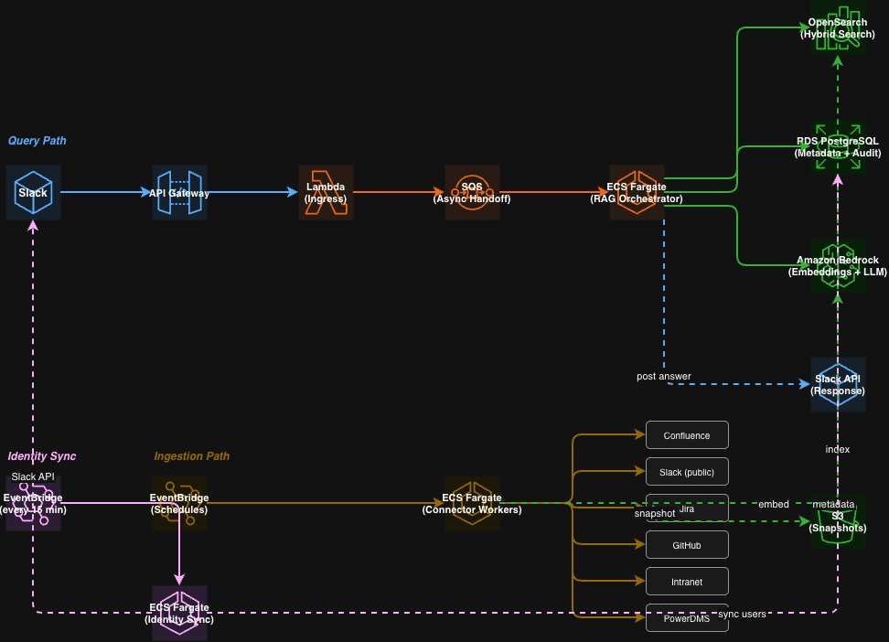

# Sage Internal Knowledge Slack Chatbot

An internal Slack chatbot that answers Sage Bionetworks employee questions using a Retrieval-Augmented Generation (RAG) architecture. It ingests content from multiple internal knowledge sources, indexes it into a hybrid search engine, and generates grounded, cited answers delivered through Slack.

## Architecture

```
Slack → API Gateway → Lambda (ingress) → SQS → ECS Fargate (RAG orchestrator)
                                                      ├── OpenSearch (hybrid search)
                                                      ├── RDS PostgreSQL (metadata & audit)
                                                      ├── Amazon Bedrock (embeddings + LLM)
                                                      └── Slack API (response)

Ingestion: EventBridge → ECS Fargate (connector workers)
                                              ├── Confluence
                                              ├── Slack
                                              ├── Jira
                                              ├── GitHub
                                              ├── Intranet
                                              └── PowerDMS

Identity: EventBridge (every 15 min) → ECS Fargate (Slack User Groups sync → PostgreSQL)
```


## Knowledge Sources (MVP)

- Confluence (all spaces)
- Slack (public channels and threads)
- Jira (all projects)
- GitHub (all repos under `Sage-Bionetworks` and `Sage-Bionetworks-IT`)
- Intranet
- PowerDMS

## Key Capabilities

- RAG pipeline built on LlamaIndex (ingestion, chunking, embedding, retrieval, generation)
- Pre-built LlamaHub readers for Confluence, Slack, Jira, GitHub, and web sources
- Grounded answers with source citations and confidence levels
- Hybrid search (keyword + vector) with source authority ranking
- Permission-aware retrieval
- Slack User Groups-based identity sync for authorization (scheduled every 15 min)
- Auditable queries, feedback, and ingestion history
- Per-user and per-channel rate limiting
- Independent connector enable/disable without redeployment

## Documentation

- [Contributing](CONTRIBUTING.md) — setup instructions, project structure, coding standards, development workflow
